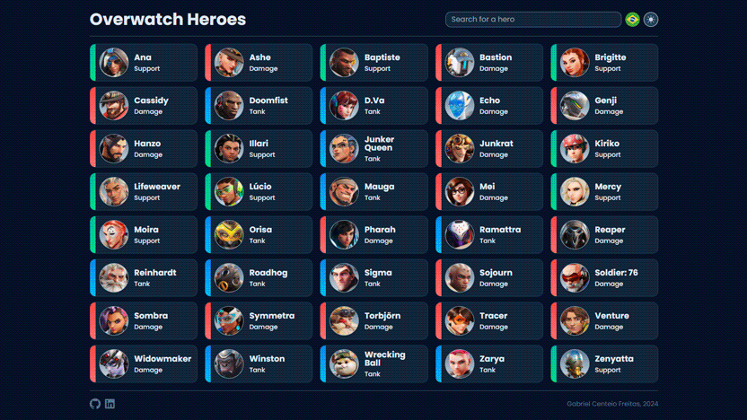

<h1 align="center">Overwatch Heroes</h1>

<p align="center">
  <a alt="ReactJS">
    
  </a>
  <a alt="NextJS">
    
  </a>
  <a alt="Typescript">
    
  </a>
  <a alt="TailwindCSS">
    
  </a>
  <a alt="Axios">
    
  </a>
</p>

<p align="center">
  <a href="#projeto">Sobre o projeto</a> •
  <a href="#executando">Executando localmente</a> •
  <a href="#tecnologias">Tecnologias</a>
</div>

<br>
<div align="center">

  [](https://overwatchheroes-gabriel-centeio-freitas-projects.vercel.app/)
</div>

<h3 align="center">
  
  [Ver projeto](https://overwatchheroes-gabriel-centeio-freitas-projects.vercel.app/)
</h3>

<br>

<a id="projeto"></a>
## 💻 Sobre o projeto

Esse projeto surgiu da necessidade de treinar e desenvolver minhas habilidades nas tecnologias, principalmente, de ReactJS e NextJS. Objetivando treinar conceitos essenciais das ferramentas, optei por construir uma aplicação simples que consumisse uma API. Além disso, o desenvolvimento de uma ferramenta de busca, opção de mudar o idioma e a adição de um DarkMode fizeram com que eu me aprofundasse nos conteúdos abordados.

Caso queira ver mais detalhes sobre o desenvolvimento do projeto, fiz uma postagem no Linkedin falando sobre, clique [aqui](https://www.linkedin.com/posts/gabrielcenteiofreitas_react-reactjs-nextjs-activity-7197660928765509632-pwLU?utm_source=share&utm_medium=member_desktop) para conferir!

Você pode acessar o projeto clicando [aqui](https://overwatchheroes-gabriel-centeio-freitas-projects.vercel.app/).

> **Créditos**:
> A API utilizada para o projeto foi a [OverfastAPI](https://overfast-api.tekrop.fr/).

<a id="executando"></a>
## 🔧 Executando localmente

#### 1. Clone o repositório
```bash
git clone https://github.com/GabrielCenteioFreitas/OverwatchHeroes.git
```

#### 2. Entre na pasta do projeto
```bash
cd OverwatchHeroes
```

#### 3. Instale as dependências
```bash
npm install
```

#### 4. Inicie o servidor de desenvolvimento
```bash
npm start
```

#### 5. Acesse [http://localhost:3000](http://localhost:3000) para visualizar a aplicação

<a id="tecnologias"></a>
## 🚀 Tecnologias

Esse projeto foi desenvolvido com as seguintes tecnologias:

- ReactJS
- NextJS
- Typescript
- TailwindCSS
- Axios
- OverFast API

## 🤝 Contribuições

Issues e pull requests são muito bem-vindos!

## 👨🏻‍💻 Autor: Gabriel Centeio Freitas 

<p align="left">
  <a alt="Github" href="https://github.com/GabrielCenteioFreitas/">
    
  </a>
  <a alt="Linkedin" href="https://www.linkedin.com/in/gabrielcenteiofreitas/">
    
  </a>
</p>
